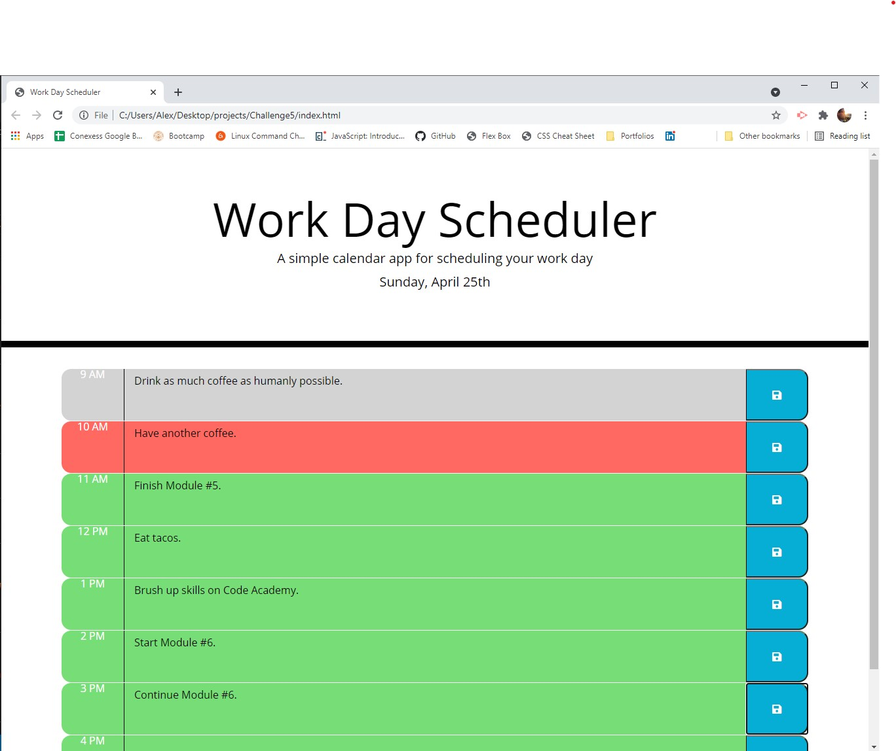

#Work Day Scheduler - Challenge #5

##Purpose
Using start code HTML and CSS, a word day scheduler to stay organized and stay on top of past, present and future tasks.

##Built With
* HTML
* CSS
* JavaScript
* Local Storage
* Bootstrap
* Moment.js
* jQuery

##Acceptance Criteria
* GIVEN I am using a daily planner to create a schedule
* WHEN I open the planner
* THEN the current day is displayed at the top of the calendar
* WHEN I scroll down
* THEN I am presented with time blocks for standard business hours
* WHEN I view the time blocks for that day
* THEN each time block is color-coded to indicate whether it is in the past, present, or future
* WHEN I click into a time block
* THEN I can enter an event
* WHEN I click the save button for that time block
* THEN the text for that event is saved in local storage
* WHEN I refresh the page
* THEN the saved events persist

##Link
https://christenson10.github.io/Challenge5/

##Picture

##Created by:
Alex Christenson, 2021